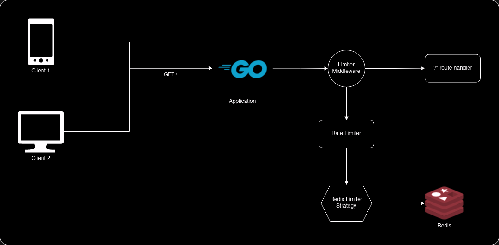
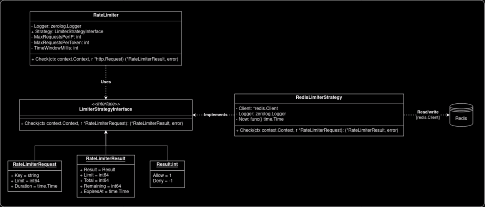

# Go Expert Challenge - Rate Limiter

Implementação de um rate limiter em Go para um serviço Web capaz de limitar o número de requisições recebidas de clientes dentro de um intervalo de tempo configurável, observando o endereço IP e/ou token de acesso `API_KEY`.

## Arquitetura



A aplicação é composta por um servidor web que recebe requisições HTTP e um middleware de rate limiter que é responsável por controlar o número de requisições recebidas. O [middleware](internal/infra/web/middlewares/ratelimiter.go) intercepta todas as requisições e executa a lógica de rate limiting a partir da instância de [`RateLimiter`](internal/pkg/ratelimiter/limiter.go), o qual contém as regras de negócio do limitador e sabe invocar a _Strategy_ de armazenamento instanciada pelo [gerenciador de dependências](internal/pkg/dependencyinjector/injector.go) para realizar a checagem de limites.

O rate limiter é configurável para realizar a checagem de limites por IP ou token `API_KEY`, e utiliza o Redis como _storage_ para armazenar a quantidade de requisições realizadas por cada IP e/ou token. Tal configuração é realizada através de variáveis de ambiente declaradas no arquivo `.env` e injetadas na aplicação através do [gerenciador de dependências](internal/pkg/dependencyinjector/injector.go), no boot da aplicação. As variáveis de ambiente são:

- `RATE_LIMITER_IP_MAX_REQUESTS`: Número máximo de requisições por IP
- `RATE_LIMITER_TOKEN_MAX_REQUESTS`: Número máximo de requisições por token
- `RATE_LIMITER_TIME_WINDOW_MILISECONDS`: Janela de tempo de vida em milissegundos

Exemplo de configuração para limitar 10 requisições por IP e 100 requisições por token em uma janela de tempo de 5 minutos:

```sh
RATE_LIMITER_IP_MAX_REQUESTS=10
RATE_LIMITER_TOKEN_MAX_REQUESTS=100
RATE_LIMITER_TIME_WINDOW_MILISECONDS=300000
```

Neste caso, o rate limiter irá bloquear requisições que excedam o limite configurado, retornando um status `429 Too Many Requests` e um corpo em JSON `{"message":"rate limit exceeded"}`, além de informar os cabeçalhos `X-Ratelimit-Limit`, `X-Ratelimit-Remaining` e `X-Ratelimit-Reset` com informações sobre o limite, quantidade restante e tempo de reset, respectivamente. Novas requisições que excedam o limite configurado serão bloqueadas até que o tempo de reset (5 minutos, no caso) seja atingido.

### Estratégia de armazenamento

A estratégia de armazenamento é definida através de uma interface `LimiterStrategyInterface` que possui o método `Check` para obter e definir valores no _storage_. No momento, a aplicação possui apenas uma implementação para o Redis, mas é possível adicionar novas implementações para outros _storages_ como memória, banco de dados, etc, sem alterar a lógica de rate limiting, apenas injetando a nova implementação na instância de `RateLimiter` através do [gerenciador de dependências](internal/pkg/dependencyinjector/injector.go).



## Benchmarks

Foi utilizado o [Grafana k6](https://k6.io/) para realizar testes de carga do tipo [_smoke_](https://grafana.com/docs/k6/latest/testing-guides/test-types/smoke-testing/) e [_stress_](https://grafana.com/docs/k6/latest/testing-guides/test-types/stress-testing/) no serviço para avaliar o comportamento da solução desenvolvida. Os resultados se encontram [aqui](./BENCHMARKS.md).

## Executando o projeto

**Obs:** é necessário ter o [Docker](https://www.docker.com/) e [Docker Compose](https://docs.docker.com/compose/) instalados.

1. Crie um arquivo `.env` na raiz do projeto copiando o conteúdo de `.env.example` e ajuste-o conforme necessário. Por padrão, os seguintes valores são utilizados:

```sh
LOG_LEVEL="debug" # Nível de log da aplicação
WEB_SERVER_PORT=8080 # Porta do servidor Web

# Configurações do Redis
REDIS_HOST="localhost"
REDIS_PORT=6379
REDIS_PASSWORD=""
REDIS_DB=0

RATE_LIMITER_IP_MAX_REQUESTS=10 # Número máximo de requisições por IP
RATE_LIMITER_TOKEN_MAX_REQUESTS=100 # Número máximo de requisições por token
RATE_LIMITER_TIME_WINDOW_MILISECONDS=1000 # Janela de tempo em milissegundos
```

2. Execute o comando `docker compose up redis api` para iniciar a aplicação e o Redis.

### Exemplos de requisições

- **Requisição com checagem via IP com sucesso:**

```sh
$ curl -vvv http://localhost:8080

* processing: http://localhost:8080
*   Trying [::1]:8080...
* Connected to localhost (::1) port 8080
> GET / HTTP/1.1
> Host: localhost:8080
> User-Agent: curl/8.2.1
> Accept: */*
> 
< HTTP/1.1 200 OK
< Accept: application/json
< Content-Type: application/json
< X-Ratelimit-Limit: 10
< X-Ratelimit-Remaining: 9
< X-Ratelimit-Reset: 1707691706
< Date: Sun, 11 Feb 2024 22:48:25 GMT
< Content-Length: 27
< 
{"message":"Hello World!"}
```

- **Requisição com checagem via token com sucesso:**

```sh
$ curl -H 'API_KEY: some-api-key-123' -vvv http://localhost:8080

* processing: http://localhost:8080
*   Trying [::1]:8080...
* Connected to localhost (::1) port 8080
> GET / HTTP/1.1
> Host: localhost:8080
> User-Agent: curl/8.2.1
> Accept: */*
> API_KEY: some-api-key-123
> 
< HTTP/1.1 200 OK
< Accept: application/json
< Content-Type: application/json
< X-Ratelimit-Limit: 100
< X-Ratelimit-Remaining: 99
< X-Ratelimit-Reset: 1707692138
< Date: Sun, 11 Feb 2024 22:55:37 GMT
< Content-Length: 27
< 
{"message":"Hello World!"}
```

- **Requisição com checagem via IP bloqueada:**

```sh
$ curl -vvv http://localhost:8080

* processing: http://localhost:8080
*   Trying [::1]:8080...
* Connected to localhost (::1) port 8080
> GET / HTTP/1.1
> Host: localhost:8080
> User-Agent: curl/8.2.1
> Accept: */*
> 
< HTTP/1.1 200 OK
< Accept: application/json
< Content-Type: application/json
< X-Ratelimit-Limit: 10
< X-Ratelimit-Remaining: 0
< X-Ratelimit-Reset: 1707691750
< Date: Sun Feb 11 2024 22:49:09 GMT
< Content-Length: 33
< 
{"message":"rate limit exceeded"}
```

- **Requisição com checagem via token bloqueada:**

```sh
$ curl -H 'API_KEY: some-api-key-123' -vvv http://localhost:8080

* processing: http://localhost:8080
*   Trying [::1]:8080...
* Connected to localhost (::1) port 8080
> GET / HTTP/1.1
> Host: localhost:8080
> User-Agent: curl/8.2.1
> Accept: */*
> API_KEY: some-api-key-123
> 
< HTTP/1.1 200 OK
< Accept: application/json
< Content-Type: application/json
< X-Ratelimit-Limit: 100
< X-Ratelimit-Remaining: 99
< X-Ratelimit-Reset: 1707692150
< Date: Sun Feb 11 2024 22:55:49 GMT
< Content-Length: 33
< 
{"message":"rate limit exceeded"}
```

## Testes

### Testes de unidade

Para executar os testes de unidade e validar a cobertura, execute o comando `make test`.

### Testes de estresse

Para executar os testes de estresse com k6, siga os passos:

1. Inicie a aplicação e o Redis com o comando `docker compose up redis api`;
2. Execute o comando `make test_k6_smoke` para iniciar o teste de estresse do tipo _smoke_ (duração de 1 minuto);
3. Execute o comando `make test_k6_stress` para iniciar o teste de estresse do tipo _stress_ (duração de 40 minutos).

**Obs:** talvez seja necessário fechar alguns programas em seu computador para que o teste de estresse não seja afetado, pois ele consome muitos recursos.

É possível visualizar os resultados dos testes obtidos por mim nas pastas `./scripts/k6/smoke` e `./scripts/k6/stress`, tanto em formato de texto quanto em HTML.
